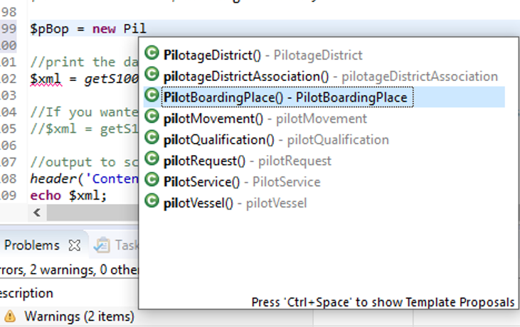
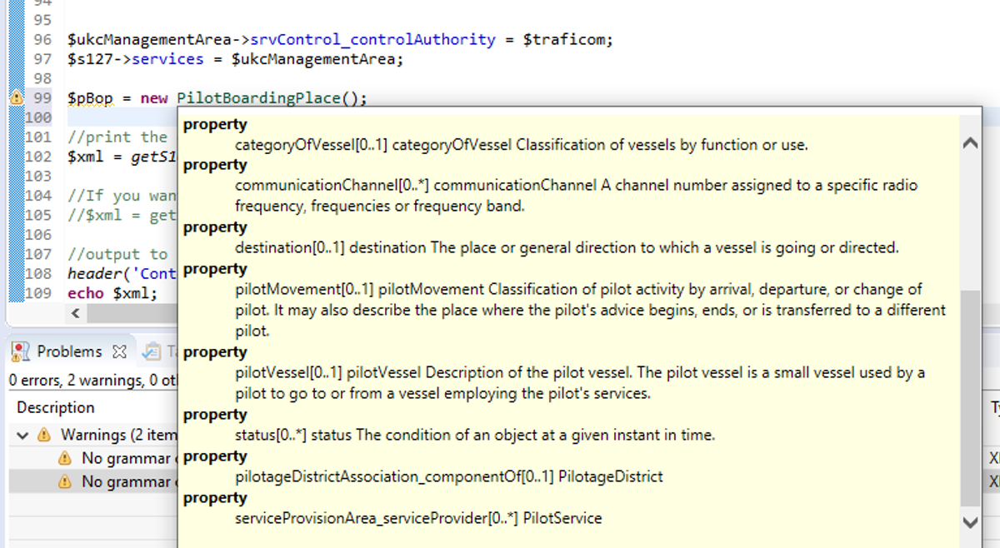

# FIHO-S-100-TOOLS

Tools related to S-100 data model testing and product development. The aim of this project is to create a framework for creating S-12X datastructures using a programming language and IDE. PHP is used here, and the framework is intended for use within the Eclipse IDE. The generated files contain PHPDoc- style comments, that provide some degree of intelligent code completion and code hinting when imported as a PHP- project in Eclipse.

## Getting started?
Currently documentation is sparse. The best way forward is to first read this README, and then check out the directory 'example'.

## Install?
The project should be straightforward to set up on any PHP- enabled webserver. It has been developed on the built-in PHP 7.x test server, and has no special requirements for the environment. Simply copy all the directories to a folder under your webroot, and point your browser to a subfolder within the 'example'- directory. 

## Setup of the project
1. PHP- classes reflecting basic S-100 structure (FeatureType, ComplexAttributeType etc)
2. XSL- translation of the S-100 Feature catalog generates the data model as PHP- classes
3. Additional data-validation and product creation using the framework and classes as regular PHP.
4. A GML- printer class is used to print out the data in the browser or to a file. 

## Structure of the classes in directory 'class'

* **CommonS100Type** - base class for all S-100 types
  * **SimpleAttributeType extends CommonS100Type** - basic building block of all values
    * **EnumerationType extends SimpleAttributeType** - allowed enumeration values are added upon construction
    *  **CodeListType extends EnumerationType** - functionally similar to the EnumerationType
  * **ComplexAttributeType extends CommonS100Type** - basic container for ALL complex objects
    * **AbstractType extends ComplexAttributeType** - common functionality for Feature- and InformationTypes
	  * **AbstractFeatureType extends AbstractType** - geometry added by default
      * **AbstractInformationType extends AbstractType** - simple extension
      * **AbstractInformationAssociation extends AbstractType** - simple extension
      * **AbstractFeatureAssociation extends AbstractType** - simple extension
  * **AbstractRole extends CommonS100Type** - simple placeholder implementation
  * **Geometry extends CommonS100Type** - handles the Geometries in FeatureTypes
 * valueTypeValidation.php - this file holds public functions for validating SimpleValues.  
  
## Structure of the classes in directory 'res'

The resource directory holds the XSLT- translation script that is used to tarnslate the machine-readable S100 FeatureCatalogue into PHP- classes. The result is a single PHP- file containing the data model, with suclasses, extending the classes in class- directory.

## Structure of the classes in directory 'print'

Currently this directory holds a single class: S100GMLPrinter. The class accepts a $rootClass - parameter, which should refer to a CommonS100Type- class. The output is a GML- document. 

## Structure of the classes in directory 'example'
This directory holds a working sample, using the S-122 Feature catalogue. 

## Notes on the current version
* Geometry supports input of WKT: LINESTRING (Line), POLYGON (Surface) and POINT (Point)
* There is NO validation of Geometries in FeatuerTypes (TODO: Add validation)

### Associations without attributes (direct references)
For associations without attributes (most associations), the associated Feature- / InformationTypes are simply added as normal attributes, and GML- references are printed between those.

### Associations with attributes (indirect references)
Associations with attributes needs to be "wrapped" in the correct AssociationClass. The AssociationClass must then also somehow be printed to GML. The AssociationClass is added as an attribute, and the associated Feature- / InformationType is put in a public property **associatedType** of the AssociationClass. 

The constructor of the AbstractType holds the logic for determining if the AssociationClass "wrapper" is needed. NOTE! There is currently (09/2022) no type- checking according to the FC implemented for the indirect references. The needed AssociationClass "wrapper" is also not displayed in the PHPDoc- documentation.
GML-printer is updated to print Associations with attributes according to S-100 5.0.0. part 10.b. 

## Author
Stefan Engström /stefan.engstrom@traficom.fi

